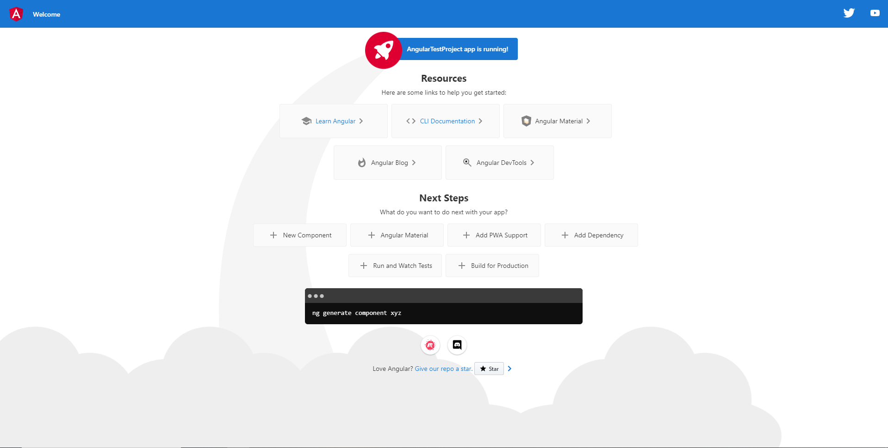

Introduction
============

### AngularJS vs Angular(2+)

* AngularCLI
* TypeScript
* Компонентоориентированный подход
* 2 сторонний биндинг
* Реактивные формы и их валидация
* Динамическая подгрузка модулей
* Более понятный для понимания

### AngularCLI

Интерфейс командной строки для работы с фреймворком. Для установки Angular CLI, достаточно ввести: 
> npm install -g @angular/cli

Далее, для создания нового Angular проекта, достаточно ввести: 
> ng new my-first-project

Чтобы увидеть то, что проект создался и запустить его, достаточно перейти в папку с проектом: 
> cd my-first-project

И запустить проект командой:
> ng serve

После чего, мы получаем доступ к стартовой странице, по адресу [http://localhost:4200/](http://localhost:4200/)

Основные команды Angular CLI (не забываем обращаться через *ng*):
* build *<название вашего приложения>* [опции]
* generate *<схема>* [опции]
* lint *<название вашего приложения>* [опции]
* new *<название вашего приложения>* [опции]
* serve *<название вашего приложения>* [опции]

### Typescript

Представляет собой типизированный JavaScript. Нативная(встроенная) поддержка Typescript в браузерах,
в большинстве своем отсутствует, поэтому для выполнения кода, Typescript конвертируется в JavaScript.
Но в Typescript присутствуют:

* Интерфейсы
* Типы
* Перечисления
* Модификаторы
* Декораторы

Которые позволяют разрабатывать код быстрее, делать его стабильнее и более удобным в дальнейшей поддержке и расширении.

### RxJs

Представляет собой реализацию инструментов, для "реактивного программирования".
Реактивное программирование - это парадигма, которая предлагает рассматривать все данные,
с которыми работает код - в виде потоков. Соответственно, потоки можно объединять, фильтровать, изменять и т.д.

Для того чтобы слушать поток, на него нужно подписаться с помощью функции *subscribe*. Метод *subscribe* принимает в себя 3 коллбека:
* success callback (вызывается как только появляются новые значения)
* error callback (вызывается как только появляются ошибки)
* complete callback (вызывается, когда завершается наш поток)

Она, в свою очередь, вернет объект типа *Subscription*, у которого есть метод *unsubscribe* - для того, чтобы отменить подписку на изменение данных.

От каждого потока нужно отписываться, как только нам данный поток не нужен. В ином случае это будет приводить к утечке данных.

Для того чтобы иметь возможность подписаться на поток, источником данных должен стать *Observable* или *Subject*.
Разница в том, что *Observable* создает событие с помощью внутреннего объекта - *observer* и внутри функции-колбека,
в то время как *Subject* может создавать событие из внешнего кода на протяжении всего своего жизненного цикла.

### HomeWork

1) Создать свой первый Angular проект 
2) Запустить его
3) Проверить его работоспособность в браузере (открыть [http://localhost:4200/](http://localhost:4200/) и увидеть приветствие)

