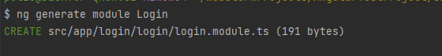
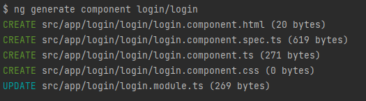
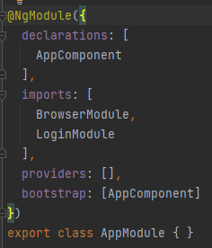
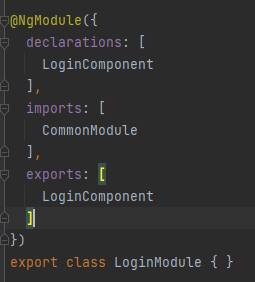
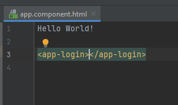
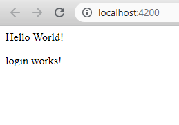
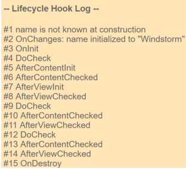
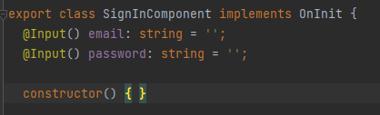
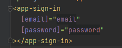

Angular Basics
============

1) <a href="#modules">NgModules</a>
2) <a href="#components">Components</a>

### <b id=base>NgModules</b>

Модули созданы для того, чтобы объединять функционал (компоненты, сервисы и т.д.) для его дальнейшего удобного импорта 
или подключения. Они представляют собой объект (класс) который описывает как должны быть собраны компоненты, 
может быть использован для подключения сервисов. По умолчанию в приложении генерируется `app.module.ts`
в котором подключен `AppComponent` и заимпорчен `BrowserModule`. Это базовый модуль. Для того чтобы объявить класс модулем,
используется декоратор `@NgModule`. У него есть такие поля:

1) declarations - используется дл декларации компонентов, директив и пайпов внутри модуля.
2) imports - импортирование других модулей, для подключения функционала в текущих модуль.
3) providers - объявление сервисов, которые будут доступны внутри модуля.
4) *bootstrap - начальный компонент, который будет подключен в* `index.html`. (deprecated)

AppModule является базовым. И самым главным модулем. Но что, если мы хотим создать новый модуль для определенного функционала?
Для этого используются так называемые feature module.

Для того чтобы не писать его руками, мы можем обратиться к и вызывать команду `ng generate module 'Имя Модуля'`:

Чтобы мы могли вывести какие-то данные, нужно создать компонент. Для этого используем команду: `ng generate component 'Имя Модуля'/'Имя Компонента'`:

Так же, ангуляр сам добавил наш новый компонент в наш новоиспеченный модуль. Но, для того, чтобы он мог отобразиться 
в нашем приложении, нужно подключить наш feature модуль в root модуль (AppModule):

Для того, чтобы вызывать наш компонент вне нашего модуля, нужно его экспортировать (занести в поле exports нашего модуля):

Далее, в `app.component.html` нужно вызывать наш новоиспеченный компонент как обычный тег, вида `<'селектор компонента'></'селектор компонента'>`:

После чего запускаем аше приложение командой `ng serve` и переходим по адресу [http://localhost:4200/](http://localhost:4200/)
и видим, что наше приложение выводит текст, который содержит наш компонент:

Поздравляю, вы создали свой первый модуль и компонент.
Теперь углубимся в то, что же такое компонент. 

### <b id=components>Components</b>

Компонент это строительный блок всего приложения. Такая деталь лего в большом приложении. Компонент позволяет отображать,
обрабатывать и украшать вывод данных. С командой для создания компонентов мы уже познакомились (`ng generate component <component-name>`).
Она создает:

1) Папку с именем компонента
2) файл компонента, <component-name>.component.ts
3) Файл шаблона (template file), <component-name>.component.html
4) Файл стилей (CSS file), <component-name>.component.css
5) Файл для тестирования (testing specification file), <component-name>.component.spec.ts

Для того чтобы создать новый компонент руками, достаточно классу в `.ts` файле добавить декоратор `@Component`.
Указать CSS selector для компонента (не забывайте, что селектор должен соответствовать имени компонента):

> @Component({
>   selector: 'app-component-overview',
> })

Указать путь к HTML template нашего компонента:

> @Component({
>   selector: 'app-component-overview',
>   templateUrl: './component-overview.component.html',
> })

Либо же прописать сам шаблон:

> @Component({
>   selector: 'app-component-overview',
>   template: '<h1>Hello World!</h1>',
> })

Указать путь к файлу со стилями: 

> @Component({
>   selector: 'app-component-overview',
>   templateUrl: './component-overview.component.html',
>   styleUrls: ['./component-overview.component.css']
> })

Или сразу указать стили:

> @Component({
>   selector: 'app-component-overview',
>   template: '<h1>Hello World!</h1>',
>   styles: ['h1 { font-weight: normal; }']
> })

И не забывайте, что класс должен быть вида:

> export class ComponentOverviewComponent {
> 
> }

## Lifecycle hooks

Так как от вызова конструкция до закрытия страницы под капотом Ангуляра происходит много процессов,
чтобы вовремя реагировать на изменения, были введены хуки жизненного цикла(Lifecycle hooks).
Они позволяют произвести определенные операции во время внутренних процессов, таких как инициализация, рендер, изменения и т.д.
Соответственно в Ангуляре есть череда хуков, которые позволяют "подписаться" на данное событие, и как только оно произойдет,
вызвать соответсвующий метод. Вот порядок вызовов всех хуков в ангуляре:

Как видим, первым вызывается конструктор. Он же создает все переменные и инициализирует их значениями. Если значение не задано,
там будет находится `undefined`. После этого, так как мы изменили состояние нашего компонента (мы проинициализировали переменные),
вызывается хук `OnChanges`, который реагирует на изменение состояния компонента. Далее, в игру вступает `OnInit`,
который означает, что компонент проиницализирован, и уже в этом хуке мы можем обращаться к `Input` и `Output` полям,
о которых поговорим позже. `AfterContentInit` - говорит нам, что контент, который мог быть передан из-вне получен.
Хук `AfterContentChecked` - аналогичен предыдущему, но дополнительно говорит, что изменения были проверены.
`ngAfterViewInit` - говорит нам, что наш шаблон(template) отобразился. `ngAfterViewChecked` - аналогичен предыдущему,
за исключением того, что проверяет изменения в состоянии темплейта. `ngOnDestroy` - вызывается при 'закрытии' компонента.

Как видим, `doCheck` делается постоянно, после каждого шага для того, чтобы отследить изменения в состоянии.

## Data binding

Для того чтобы можно было взаимодействовать компонентам друг с другом, существует биндинг.
Он закрепляет соответствие поля одного компонента - полю другого компонента. Для того чтобы "пробросить" значение в дочерние и/или родительские компоненты.
Для того чтобы объявить поле как "входящее", нужно добавить декоратор(не забывайте его заимпортить) `@Input()` перед именем поля.

Если нам, по какой-то причине, нужно изменить "внешнее" имя переменной (которое будет указано в HTML),
мы можем передать его в качестве параметра декоратора `@Input(fieldName) field`.
Для того чтобы связать поля родительского компонента с дочерним, достаточно передать имя поля дочернего компонента в квадратных скобках,
и имя поля в родительском классе, на подобии атрибутов в HTML:

Так же мы можем использовать для этого геттеры и сеттеры:

> @Input() name: string = '';

...

> ngOnChanges(changes: SimpleChanges) {
>   if (changes.name) {
>       doSomething();
>   }
> }

Где мы и можем отслеживать изменение входящего аттрибута, к примеру. Либо же, мы можем отслеживать изменения через `onChanges`:

> @Input()
> get name(): string { return this._name; }
> set name(name: string) {
>   this._name = (name && name.trim()) || '<no name set>';
> }
> private _name = '';

Но это все было относительно "входящих" полей. Но что, если нам наоборот, нужно в родительском компоненте реагировать на изменение в дочернем?
Для этого есть "исходящие" поля. Они из себя представляют передатчик событий(EventEmitter) и обозначаются `@Output()` декоратором.

> @Output() voted = new EventEmitter<boolean>();

Чтобы сообщить о том, что произошло событие, на которое должен отреагировать родитель,
достаточно дернуть метод `emit` у данного поля и/или передать туда, то что должен получить родитель.

> vote(agreed: boolean) {
>   this.voted.emit(agreed);
>   this.didVote = true;
> }

Со стороны родительского класса требуется объявление поля в круглых скобках и присваивание этому полю
функции-обработчика(handler) или же колбека(callback) (`onVoted`), которая обработает событие. Обратите внимание,
что в примере мы предали туда $event, так как это имя переменной, в которой будет содержаться значение,
переданное в дочернем компоненте:

> <app-voter
>   *ngFor="let voter of voters"
>   [name]="voter"
>   (voted)="onVoted($event)">
> /app-voter>

> onVoted(agreed: boolean) {
>   agreed ? this.agreed++ : this.disagreed++;
> }

Для того чтобы использовать одну переменную и как "входящий" и как "исходящий параметр", используется two-way data binding.
В родительском темплейте это выглядит как поле в квадратных и круглых скобках(`[(fieldName)]`).
> <app-sizer [(size)]="fontSizePx"></app-sizer>

В дочернем же классе нужно придерживаться правил именования, где "исходящим" должно быть поле вида
`inputChange` где `input` - имя "входящего" поля.

> export class SizerComponent {
>   @Input()  size!: number | string;
>   @Output() sizeChange = new EventEmitter<number>();

>   dec() { this.resize(-1); }
>   inc() { this.resize(+1); }

>   resize(delta: number) {
>       this.size = Math.min(40, Math.max(8, +this.size + delta));
>       this.sizeChange.emit(this.size);
>   }
> }

Так же, дочерние переменные можно помечать "локальными переменными" и обращаться к его методам и полям, как к объекту.

> @Component({
>   selector: 'app-countdown-timer',
>   template: '
{{message}}
'
> })
> export class CountdownTimerComponent implements OnDestroy {

>   intervalId = 0;
>   message = '';
>   seconds = 11;

>   ngOnDestroy() { this.clearTimer(); }

>   start() { this.countDown(); }
>   stop()  {
>       this.clearTimer();
>       this.message = `Holding at T-${this.seconds} seconds`;
>   }
> }

> import { Component } from '@angular/core';
> import { CountdownTimerComponent } from './countdown-timer.component';

> @Component({
>   selector: 'app-countdown-parent-lv',
>   template: `
>       <h3>Countdown to Liftoff (via local variable)</h3>
>       <button (click)="timer.start()">Start</button>
>       <button (click)="timer.stop()">Stop</button>
>       
{{timer.seconds}}

>       <app-countdown-timer #timer></app-countdown-timer>
>   `,
>   styleUrls: ['../assets/demo.css']
> })
> export class CountdownLocalVarParentComponent { }

В данном примере `#timer` - это "локальная переменная", с помощью которой обращаются к методам `start` и `stop`.
Но, она может использоваться только внутри темплейта. Для того чтобы обратиться к дочернему компоненту, можно использовать
`@ViewChild(ComponentName)` декоратор для переменных. Который говорит, что данный компонент будет помещен в переменную.

> @ViewChild(CountdownTimerComponent) private timerComponent: CountdownTimerComponent;

## Component Styles

Для удобства, все стили объявленные внутри компонента, инкапсулированы. И не будут применяться к элементам с такими же селекторами.
Что не даёт перетереть стили в большом приложении. В связи с этим, было добавлено несколько возможностей оп стилизации компонентов.

`:host` - используется для стилизации "обёртки" компонента (элемента с названием, который соответствует селектору компонента).

> :host {
    font-style: italic;
  }

`:host-context` - Используется для изменения стилей родительских элементов

> :host-context(.active) { // применится ко всем элементам с классом `active` среди родительских элементов
    font-style: italic;
}

`::ng-deep` - Позволяет игнорировать инкапсуляцию для объявленных стилей ниже

> :host ::ng-deep h3 { // Применит стили ко всем h3 внутри компонента (включая дочерние)
    font-style: italic;
}

## Content Projection

Для случаев, когда нужно прокинуть темплейт или его часть внутрь себя, можно использовать `<ng-content>` в дочернем темплейте,
чтобы обозначить, куда будет вставлен этот кусок шаблона.

> selector: 'app-zippy-basic',
> template: `
>   <h2>Single-slot content projection</h2>
>   <ng-content></ng-content>
> `

В родительском темплейте мы просто располагаем темплейт, который будет передан в дочерний,
между открывающим и закрывающим тегом дочернего элемента:

> /<app-zippy-basic>
>   /
Is content projection cool?

> /</app-zippy-basic>

## Multi-slot content projection

Для передачи нескольких темплейтов, нужно обозначит их атрибутом `select`, в дочернем темплейте:

> selector: 'app-zippy-multislot',
> template: `
> \<h2>Multi-slot content projection\</h2>

>     Default:
>     <ng-content></ng-content>

>     Question:
>     <ng-content select="[question]"></ng-content>
> `
> })

И добавить аттрибут с таким же именем в родительском темплейте: 
> \<app-zippy-multislot>
>   \

>     Is content projection cool?
>   \

>   \
Let's learn about content projection!

> \</app-zippy-multislot>

## Conditional content projection

Если же вам нужно рендерить темплейт или его часть по условию или же несколько раз, нужно указать
`<ng-template>` который принимает контент для рендера.

В дочернем: 
> \

>    \<ng-container [ngTemplateOutlet]="content.templateRef"></ng-container>
> \

В родительском:
> \<ng-template appExampleZippyContent>
>   It depends on what you do with it.
> \</ng-template>

Так же, для этого необходимо создать директиву:

> @Directive({
>   selector: '[appExampleZippyContent]'
> })
> export class ZippyContentDirective {
>   constructor(public templateRef: TemplateRef<unknown>) {}
> }

Для доступа из родительского компонента, к контенту в дочернем:

> @ContentChild(ZippyContentDirective) content!: ZippyContentDirective;

## HomeWork

1) Создать свой компонент
2) Вывести в нём поля объекта, интерфейс для которого вы делали в предыдущем ДЗ
